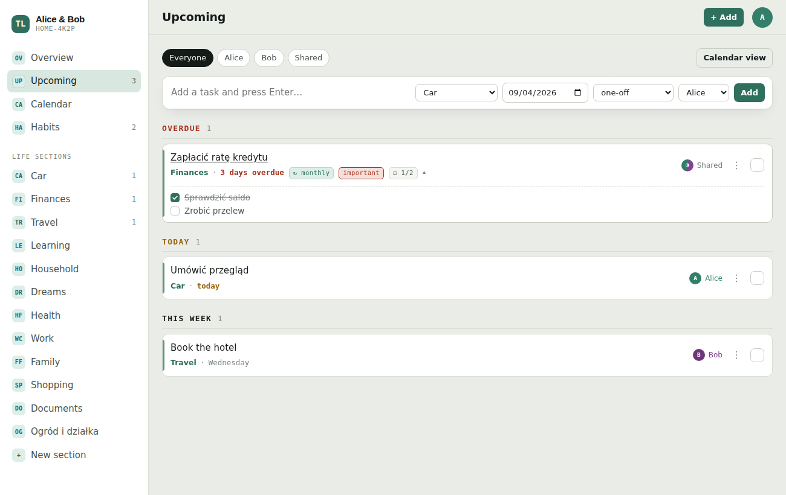
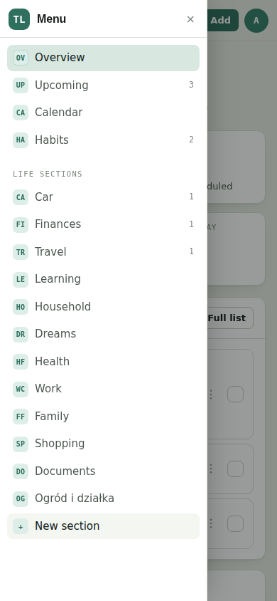

# The Life

A shared web app for running your whole life and your household — together.
Learning, the house, the car, money, dreams and future travel in one place, with tasks
(including repeating ones), notes, habits and a single timeline of what's coming up.

Two people, two accounts, one board: whatever one of you adds shows up on the other's
screen right away.

## How sharing works

1. Each person creates their own account (email + password).
2. One of you creates a board — it comes with eleven ready sections.
3. That board has an invite code, e.g. `HOME-4K2P`. The other person picks **Join with a
   code** and enters it.
4. From then on you both read and write the same board, live. Every task, note and habit
   is assigned to one of you or marked **Shared**, and every view can be filtered by person.

Nobody outside the board can read a single row: access is enforced in the database itself
(Postgres row level security), not in the browser.

## Setup — about five minutes, no terminal

**1. Create the database.** Sign up at [supabase.com](https://supabase.com) and create a
free project. Any region near you is fine; keep the database password somewhere safe.

**2. Create the tables.** In the project, open **SQL Editor → New query**, paste the whole
contents of [`supabase/schema.sql`](supabase/schema.sql) and press **Run**. It creates the
tables, the access rules and the `create_board` / `join_board` functions.

The file is written to be run again at any time: when a change here adds a column or a rule,
re-running it is the whole migration. **Run it again after pulling** — the recent ones are the
`members_update` policy (without it your colour and your name look saved and come back on the
next read), dates that may now be empty, an icon on every section, the `feedback` table,
the `calendar_feeds` table with its `calendar_token` function, and `colour` on `board_members`.

**3. Turn off email confirmation** (optional, but easier for two people).
**Authentication → Sign In / Providers → Email** → switch **Confirm email** off. With it on,
each of you has to click a link in an email before the first sign-in.

**4. Copy your keys.** **Project Settings → API Keys**: copy the **Project URL**
(just `https://<ref>.supabase.co`, with nothing after it) and the public client key —
**Publishable key** (`sb_publishable_...`), or the **anon public** key from the Legacy tab.
Paste both into [`config.js`](config.js).

**4a. Point the email links at your app.** **Authentication → URL Configuration**: set
**Site URL** to the address you actually open the app at (for example
`https://<user>.github.io/the-life`) and add the same address under **Redirect URLs**.
Without this, the link in a password-reset email sends people to `localhost:3000`.

**4b. Deploy the calendar feed** (optional — only if you want tasks on your phone's calendar).
**Edge Functions → Deploy a new function → via Editor**, name it `calendar`, paste the whole of
[`supabase/functions/calendar/index.ts`](supabase/functions/calendar/index.ts), and **turn Verify
JWT off** before deploying. A calendar app sends no sign-in, so with that switch on it gets a 401
and the subscription silently never works. Nothing else to configure — the function reads the
project's own keys from its environment, and the secret one never leaves it.

**5. Open the app.** Double-click `index.html`, or push the repository and serve it from
GitHub Pages (**Settings → Pages → Source: GitHub Actions** — the workflow is already in
`.github/workflows/pages.yml`). Then send the address to the other person.

> The anon key is meant to be public — it identifies the project, it does not grant access.
> What a signed-in person may read or write is decided by the row level security policies in
> `schema.sql`. Never put the **service_role** key in this repository.

  
  

## What's in it

| Screen | What it does |
| --- | --- |
| Sign in | Real accounts: email and password, session kept across devices, password reset by email |
| Boards | Your boards, create a new one, or join one with an invite code |
| Overview | Overdue / due today / closed so far / habits, what's next, and the section grid |
| Tasks | One timeline: Overdue → Today → Tomorrow → This week → Next week → Later, cut to how far ahead you want to look — **today** by default, or a week, a month, a year, everything |
| Calendar | Month view; the colour bar is the section, a red outline means the date has passed |
| Habits | 14-day grid, click any day (past days included), streaks; a habit ticked off today lights up in its owner's colour and says whose it is. Click a habit's name to rename it, move it, change how often or delete it |
| Section | Tasks, notes, habits and history for that part of life |
| Account | Your picture in the top-right corner: settings, sharing, switching boards and signing out |
| Sharing | Invite code (the owner can roll it), who is on the board, and their roles |
| Settings | Profile picture, your colour and the app colour, interface language (English / Polski), theme, your name on the board, the calendar link, password |

### Life sections

Learning · Dreams · Travel · Household · Car · Finances ·
Health & Fitness · Work & Career · Family & Friends · Shopping & Pantry · Documents & Renewals

Every section carries an icon you pick when you create it (32 to choose from), and the
navigation shows those instead of two-letter codes. Sections are data, not code — rename them
in the `sections` table, or add your own with **New section** in the navigation. **Delete section** on a section's page removes it together
with everything inside it, after a dialog that counts what will go.

### Tasks with no date

Not everything has a day. A task can be saved with **No date** — the date and the repeat rule
grey out — and it then stays out of the way: invisible under *today*, *a week*, *a month* and
*a year*, gathered under **No date** at the end of *everything*, and on its own under the
**No date** range. It is a list of things to do eventually, not a debt with a deadline.

### Calendar on your phone

**Settings → Calendar on your phone → Set it up** hands you a private address. A calendar app
cannot sign in, so it subscribes to that address instead and asks for it again every so often;
the token in it is the key, which is why it is long, random, and replaceable — **New link** kills
the old one on the spot.

What arrives there is every dated task on the board, whoever it belongs to, as an all-day entry:
the section's icon, the title, and who it is for. The notes and the checklist ride along in the
description, and a reminder goes off at **20:00 the evening before**. Tasks with no date and
finished tasks stay out; habits stay in The Life. A task that repeats on a fixed rhythm becomes a
repeating event the calendar can work out for itself — one set to count from when it is ticked
off cannot, so it appears at its current date and moves on the next refresh.

On an iPhone: **Settings → Apps → Calendar → Calendar Accounts → Add Account → Other → Add
Subscribed Calendar**. From then on the tasks are in the normal Calendar app, so the calendar
widget shows them with no extra work. Google Calendar takes the same address under **Other
calendars → + → From URL**.

Two things worth knowing. It **only reads** — ticking off, editing and deleting happen here, and
the calendar catches up when it next asks. And it asks on its own schedule: an iPhone roughly
hourly, Google sometimes once or twice a day, so subscribe on the phone itself if you want the
board and the calendar to stay close.

### Suggest an improvement

Under your picture, next to Sharing: a box to type what annoyed you or what is missing. It
goes to the `feedback` table with who wrote it, which board, and where in the app they were.
Read them in Supabase → **Table editor → feedback**; only the person who wrote a line can read
it back through the app.

### The four tiles

Three of them are debts — what has slipped, what is due today, how many habits are still
untouched — so the fourth is credit: **Done**, every task the two of you have ever closed.
All four follow the person filter, so "mine" counts only your own and the shared ones.

Repeating tasks are not in that count: they never close, they move to their next date. What
it counts is the things that were finished and stayed finished.

### How far ahead

The Tasks list opens on **today**: what has slipped, plus what is due now. The picker to the
left of the person filters widens it to a week, a month, a year or everything, and remembers
what you chose on that device. Overdue tasks are in every range — a date that has passed is
not "later", it is waiting — and a line under the list says how many tasks sit beyond the
range you are looking at.

### Repeating tasks

A task can repeat: `daily`, `weekly`, `every 2 weeks`, `monthly`, `quarterly`, `yearly`.
Ticking a repeating task does not close it — it moves to its next date.

Each repeating task also carries a switch, **off by default**:

- **off** — the fixed rhythm. "Every week" means every week on the same day, whenever you
  tick it off; missed occurrences are caught up so the date never stays in the past.
- **on** — *count the next date from when it's ticked off*. Wash the car four days early and
  the next one is due a week from that moment, not from the old date.

### Editing, notes and checklists

**Hold a task or a habit** — a long press on a phone, a right-click or a held mouse button on
a laptop — and a small menu offers **Edit** and **Delete**. Tapping a task that carries
nothing to unfold opens the same editor: title, section, date, repeat rule, who it belongs
to, whether it's important. Clicking the section name on a task jumps straight to that
section.

Nothing is deleted on one click: a task, a habit, a note or a section always asks first, and
says what goes with it.

A task can also carry **notes** (account numbers, an address, what was agreed) and a
**checklist**. Tapping a task that has either unfolds them in place — the note, then the
steps, tickable one by one. The tick sits at the far right, in the same place as a habit's,
so both are closed with the same gesture.

**+ Add** in the top bar asks what you are adding — **TASK** or **HABIT** — and opens the
full form for it. The same button sits at the foot of the Tasks, Habits and section lists, so
adding always uses one dialog rather than a cramped inline row: a task with its notes, steps,
repeat rule and owner; a habit with its section, person and how often.

  

### On a phone

Below 900 px the sidebar becomes a drawer: three lines in the top-left corner — or a swipe
rightwards from the left edge — slide the whole navigation out, headed by **Menu**. It
retracts to the left on close, on a swipe left, on Escape, or when you pick something. The
top bar carries the view's name, then **+ Add** and your picture. Nothing scrolls sideways.

  

The layout also stays where you put it. A board is a list you tap, not a map you zoom, so
pinch-zoom and double-tap zoom are off, and every field is at least 16 px — below that Safari
zooms into the page the moment a field takes focus, which is how it usually ended up stranded
at 2×. Scrolling, panning and the browser's own zoom (⌘+ / Ctrl+) are untouched.

The browser's own pull-to-refresh is off as well, replaced by the app's: pull down at the top
of a list and the page stretches, springs back on release, and reloads the board.

### Who a thing belongs to

Tasks and habits carry the name and picture of whoever they are assigned to, and a row
assigned to one person takes that person's colour: their tick, the flash when it is ticked
off, and the tint a habit gets for the day. Shared rows keep the colour of their section.

### Colours

**Settings → Colours** has two of them, each a normal colour picker — the swatch opens the
one your phone or laptop already uses, and next to it the hex is there if you know exactly
what you want. Ten ready colours sit underneath for people who would rather just point, and
the arrow puts it back to the green it started as.

- **Your colour** — your initials, and the tasks and habits that are yours. It lives on the
  board, so the other person sees it too. Pick one close to theirs and a line says so; it
  does not stop you, it just points out that the two of you will be hard to tell apart.
- **App colour** — buttons, the menu, the highlights, and the quiet tint the paper and the
  text carry. This one is a choice about your own screen, like the theme, so it stays on the
  device: one of you can run the board in plum and the other in green.

Only the hue and how much colour it carries are taken from what you pick; how light or dark
each thing is stays as the design set it. That is what keeps white text readable on a button
and a pale note pale, whatever colour ends up behind them — no combination in the picker can
drop the text below a legible contrast. The preview under the two rows shows a sample row in
your colour; the app colour needs no preview, because the whole screen behind the dialog
repaints while you drag.

### Small things that matter

Ticking a task off plays a short farewell — the row flashes in the owner's colour, the tick
draws itself and the row collapses away — so you see what happened without reading a
message. A repeating task slides sideways instead, because it is coming back. A ticked habit
washes its colour across the row. Lists arrive with a short stagger rather than blinking
into place. Phones that support it give a small buzz on a tick (iOS Safari has no vibration
API, so there it is silent).

Pulling down at the top of a list stretches the page and refreshes on release, with the
rubber band and spring the browser's own gesture would have given; the end of a list gives a
little too. A ticked task does not fade politely — it flashes in its owner's colour and bolts
off the right edge before the row collapses.

All of it respects the system "reduce motion" setting.

### Language

Each person picks their own interface language in **Settings** — English or Polish. It is a
per-device choice, so one of you can read the app in Polish while the other reads it in
English. What either of you types (tasks, notes, sections, habits) is never translated.

## How it is built

| | |
| --- | --- |
| `index.html` | page shell |
| `styles.css` | all styling; light and dark themes driven by CSS custom properties |
| `app.js` | the whole app: auth, data, realtime, rendering (vanilla JS, no framework) |
| `i18n.js` | interface translations and the default section labels |
| `config.js` | your project URL and anon key |
| `vendor/supabase.js` | supabase-js v2, vendored so the app has no CDN dependency |
| `supabase/schema.sql` | tables, row level security policies, RPC functions, realtime |
| `supabase/functions/calendar/index.ts` | the calendar feed, deployed as a Supabase edge function |

No build step and no package manager: what is in the repository is what runs.

## Roadmap

- [ ] Notifications (push / email) for upcoming and overdue dates
- [ ] Subtasks, attachments and comments on tasks
- [ ] Renaming sections and reordering by drag
- [ ] Per-section privacy — a section only one of you can see
- [ ] PWA with offline mode

## Licence

MIT — see [LICENSE](LICENSE).
