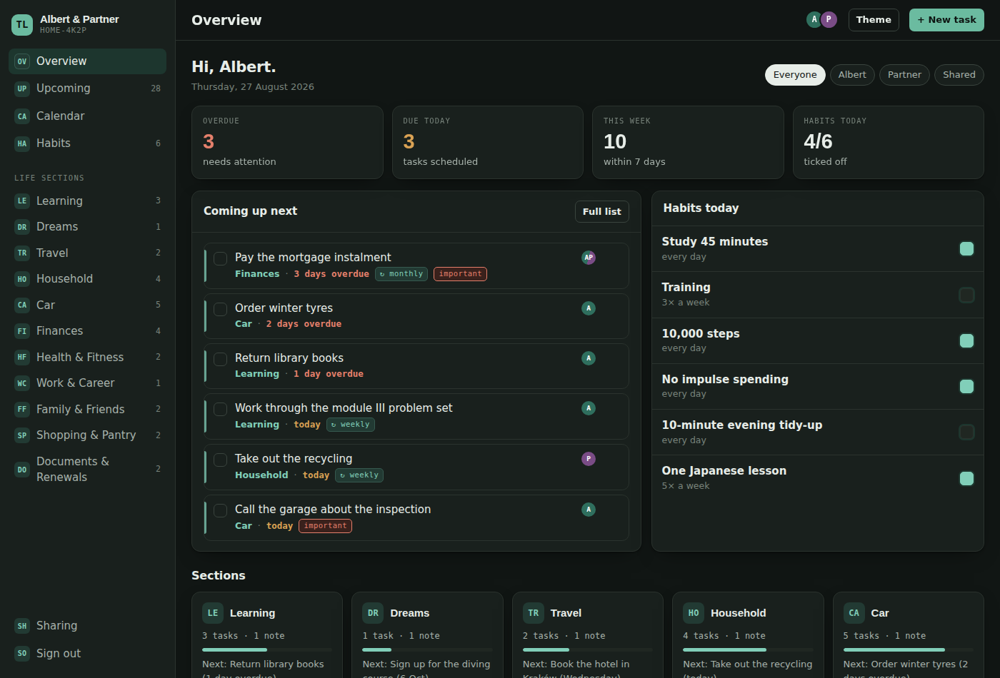

# The Life

A shared web app for running your whole life and your household — together.
One place for learning, the house, the car, money, dreams and future travel, with tasks
(including repeating ones), notes, habits and a single timeline of what's coming up.

**This is a prototype** — a working, clickable front end with sample data.
There is no backend yet: state lives in the browser's `localStorage`.


## Demo

Open `index.html` in a browser, or serve it locally:

```bash
python3 -m http.server 8000
# http://localhost:8000
```

Once GitHub Pages is enabled (Settings → Pages → Source: GitHub Actions), every push to
`main` publishes the demo automatically.

## What's in it

| Screen | What it does |
| --- | --- |
| Sign in | Prototype sign-in and sign-up (any credentials get you in) |
| Choose a board | Enter an existing board, create a new one, or join with an invite code |
| Overview | Overdue / due today / this week / habits, what's coming next, and the section grid |
| Upcoming | Every task on one timeline: Overdue → Today → Tomorrow → This week → Next week → Later |
| Calendar | Month view; the colour bar is the section, a red outline means the date has passed |
| Habits | 14-day grid, click any day (including past ones), streak counting, habits belong to sections |
| Section | Tasks, notes, key facts, habits and history for that part of life |
| Sharing | Invite code, people on the board, roles and access scope |

### Life sections

Learning · Dreams · Travel · Household · Car · Finances ·
Health & Fitness · Work & Career · Family & Friends · Shopping & Pantry · Documents & Renewals

Each section has its own colour (derived from a single `--h` custom property), a set of key
facts, tasks, notes and habits.

### Repeating tasks

A task can repeat: `daily`, `weekly`, `every 2 weeks`, `monthly`, `quarterly`, `yearly`.
Ticking a repeating task does not close it — it moves to its next date (and catches up on
occurrences that were skipped in the past).

### Sharing

A board belongs to the household, not to one person. The second person joins with an invite
code and sees the same sections and tasks. Every task, note and habit is assigned to
**Albert / Partner / Shared**, and the filters in every view work on that field.

The interface is in English; task and note content is free text, so writing everything in
Polish (or any other language) works fine.

<p align="center">
  
  
</p>

## Stack

A single `index.html` — HTML, CSS and vanilla JS, no dependencies and no build step.
Light and dark themes (system preference plus a manual toggle), responsive layout,
type: Bricolage Grotesque + Source Sans 3 + IBM Plex Mono (Google Fonts).

## Roadmap

- [ ] Backend: accounts, boards, members, per-section permissions
- [ ] Data model and API (tasks, notes, habits, recurrence as RRULE)
- [ ] Real-time sync between people on a board
- [ ] Notifications (push / email) for upcoming and overdue dates
- [ ] Subtasks, attachments and comments on tasks
- [ ] iCal export so dates land in a normal calendar
- [ ] Mobile app or PWA with offline mode

## Licence

MIT — see [LICENSE](LICENSE).
