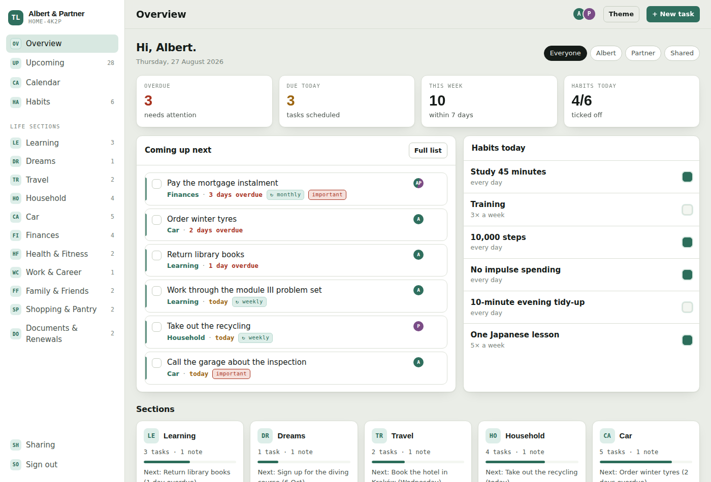
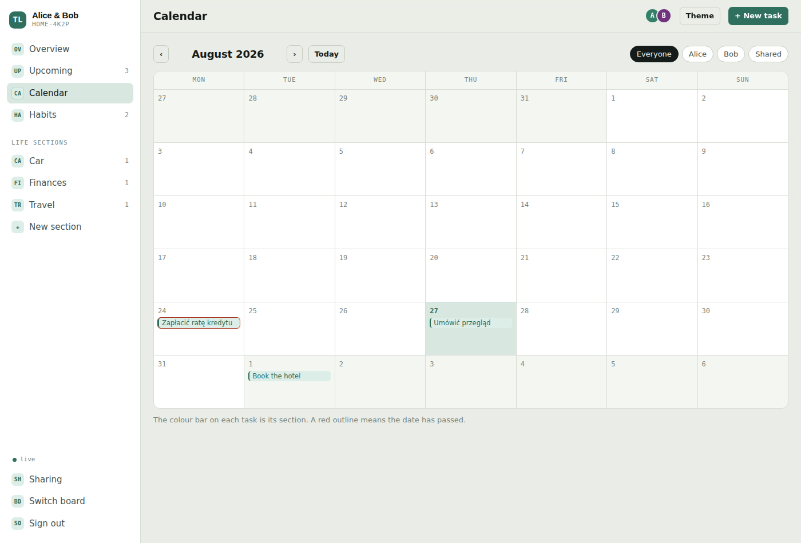
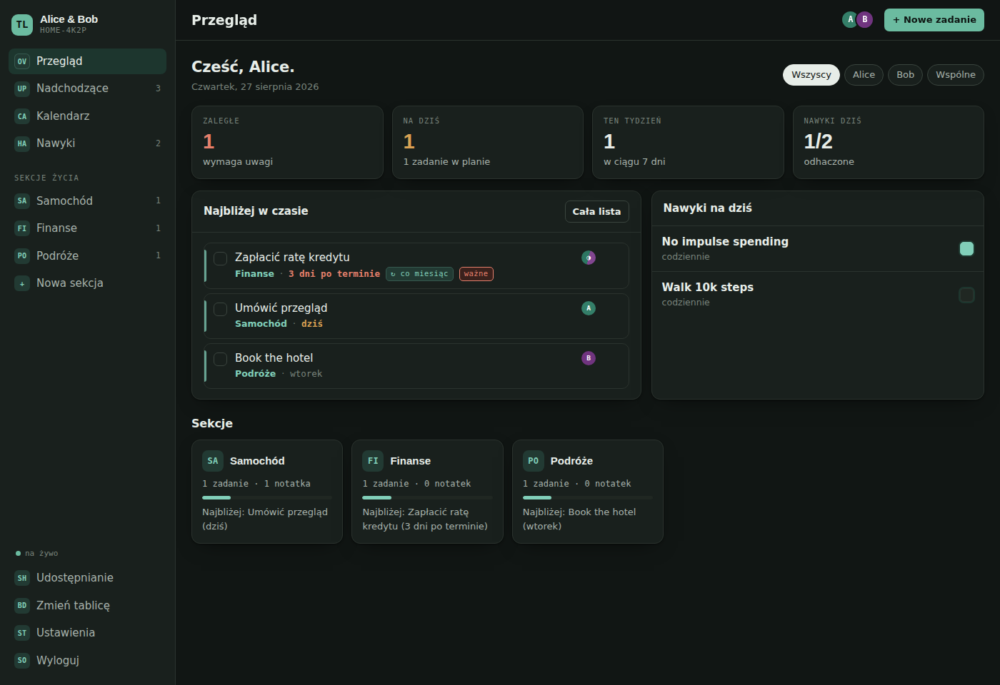

# The Life

A shared web app for running your whole life and your household — together.
Learning, the house, the car, money, dreams and future travel in one place, with tasks
(including repeating ones), notes, habits and a single timeline of what's coming up.

Two people, two accounts, one board: whatever one of you adds shows up on the other's
screen right away.

## How sharing works

1. Each person creates their own account (email + password).
2. One of you creates a board — it comes with eleven ready sections.
3. That board has an invite code, e.g. `HOME-4K2P`. The other person picks **Join with a
   code** and enters it.
4. From then on you both read and write the same board, live. Every task, note and habit
   is assigned to one of you or marked **Shared**, and every view can be filtered by person.

Nobody outside the board can read a single row: access is enforced in the database itself
(Postgres row level security), not in the browser.

## Setup — about five minutes, no terminal

**1. Create the database.** Sign up at [supabase.com](https://supabase.com) and create a
free project. Any region near you is fine; keep the database password somewhere safe.

**2. Create the tables.** In the project, open **SQL Editor → New query**, paste the whole
contents of [`supabase/schema.sql`](supabase/schema.sql) and press **Run**. It creates the
tables, the access rules and the `create_board` / `join_board` functions.

The file is written to be run again at any time: when a change here adds a column, re-running
it is the whole migration. (Run it again now if your project was set up before the
`recur_from_completion` column arrived.)

**3. Turn off email confirmation** (optional, but easier for two people).
**Authentication → Sign In / Providers → Email** → switch **Confirm email** off. With it on,
each of you has to click a link in an email before the first sign-in.

**4. Copy your keys.** **Project Settings → API Keys**: copy the **Project URL**
(just `https://<ref>.supabase.co`, with nothing after it) and the public client key —
**Publishable key** (`sb_publishable_...`), or the **anon public** key from the Legacy tab.
Paste both into [`config.js`](config.js).

**4a. Point the email links at your app.** **Authentication → URL Configuration**: set
**Site URL** to the address you actually open the app at (for example
`https://<user>.github.io/the-life`) and add the same address under **Redirect URLs**.
Without this, the link in a password-reset email sends people to `localhost:3000`.

**5. Open the app.** Double-click `index.html`, or push the repository and serve it from
GitHub Pages (**Settings → Pages → Source: GitHub Actions** — the workflow is already in
`.github/workflows/pages.yml`). Then send the address to the other person.

> The anon key is meant to be public — it identifies the project, it does not grant access.
> What a signed-in person may read or write is decided by the row level security policies in
> `schema.sql`. Never put the **service_role** key in this repository.

  
  

## What's in it

| Screen | What it does |
| --- | --- |
| Sign in | Real accounts: email and password, session kept across devices, password reset by email |
| Boards | Your boards, create a new one, or join one with an invite code |
| Overview | Overdue / due today / this week / habits, what's next, and the section grid |
| Upcoming | Every task on one timeline: Overdue → Today → Tomorrow → This week → Next week → Later |
| Calendar | Month view; the colour bar is the section, a red outline means the date has passed |
| Habits | 14-day grid, click any day (past days included), streaks, habits belong to sections |
| Section | Tasks, notes, habits and history for that part of life |
| Sharing | Invite code (the owner can roll it), who is on the board, and their roles |
| Settings | Interface language (English / Polski), theme, your name on the board, password |

### Life sections

Learning · Dreams · Travel · Household · Car · Finances ·
Health & Fitness · Work & Career · Family & Friends · Shopping & Pantry · Documents & Renewals

Sections are data, not code — rename them in the `sections` table, or add your own with
**New section** in the sidebar.

### Repeating tasks

A task can repeat: `daily`, `weekly`, `every 2 weeks`, `monthly`, `quarterly`, `yearly`.
Ticking a repeating task does not close it — it moves to its next date.

Each repeating task also carries a switch, **off by default**:

- **off** — the fixed rhythm. "Every week" means every week on the same day, whenever you
  tick it off; missed occurrences are caught up so the date never stays in the past.
- **on** — *count the next date from when it's ticked off*. Wash the car four days early and
  the next one is due a week from that moment, not from the old date.

### Editing

Click a task's title — anywhere it appears, the calendar included — to edit it: title,
section, date, repeat rule, who it belongs to, whether it's important. Clicking the section
name on a task jumps straight to that section.

### Language

Each person picks their own interface language in **Settings** — English or Polish. It is a
per-device choice, so one of you can read the app in Polish while the other reads it in
English. What either of you types (tasks, notes, sections, habits) is never translated.

## How it is built

| | |
| --- | --- |
| `index.html` | page shell |
| `styles.css` | all styling; light and dark themes driven by CSS custom properties |
| `app.js` | the whole app: auth, data, realtime, rendering (vanilla JS, no framework) |
| `i18n.js` | interface translations and the default section labels |
| `config.js` | your project URL and anon key |
| `vendor/supabase.js` | supabase-js v2, vendored so the app has no CDN dependency |
| `supabase/schema.sql` | tables, row level security policies, RPC functions, realtime |

No build step and no package manager: what is in the repository is what runs.

## Roadmap

- [ ] Notifications (push / email) for upcoming and overdue dates
- [ ] Subtasks, attachments and comments on tasks
- [ ] Renaming sections and reordering by drag
- [ ] Per-section privacy — a section only one of you can see
- [ ] iCal export so dates land in a normal calendar
- [ ] PWA with offline mode

## Licence

MIT — see [LICENSE](LICENSE).
